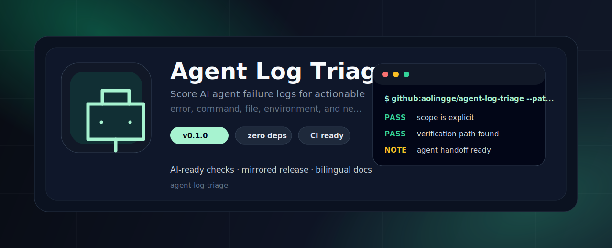
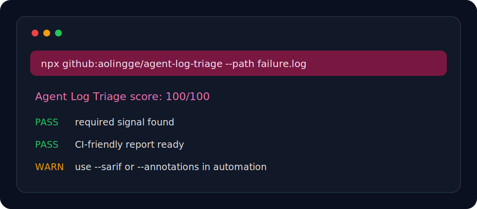

<p align="center">
  
</p>

<h1 align="center">Agent Log Triage</h1>

<p align="center">Score AI agent failure logs for actionable error, command, file, environment, and next-step signals.</p>

<p align="center"><a href="README.zh-CN.md">中文</a> · <a href="#quick-start">Quick Start</a> · <a href="#checks">Checks</a></p>

<p align="center">
  
  
  
</p>

<p align="center">
  
</p>

## Why This Exists

AI agent workflows keep growing, but many repos still lack tiny local checks that are easy to run in CI. This tool stays zero-dependency, mirror-friendly, and easy to fork.

## Quick Start

```bash
npx github:aolingge/agent-log-triage --path failure.log
```

Generate Markdown:

```bash
npx github:aolingge/agent-log-triage --path failure.log --markdown > report.md
```

Generate SARIF:

```bash
npx github:aolingge/agent-log-triage --path failure.log --sarif > results.sarif
```

## Checks

| Check | What it looks for |
| --- | --- |
| error | Contains error signal. |
| command | Contains command context. |
| file | Contains file or line context. |
| next | Contains next-step hint. |

## CI Usage

See [docs/github-actions.md](docs/github-actions.md).

## Mirrors

- GitHub: https://github.com/aolingge/agent-log-triage
- Gitee: https://gitee.com/aolingge/agent-log-triage

## Visual Identity

The banner and CLI preview are SVG assets committed in `assets/`, so the README renders cleanly on GitHub and Gitee without external image hosting.

## Contributing

Good first PRs: add checks, add fixtures, improve docs, or add GitHub Actions examples.

## License

MIT
